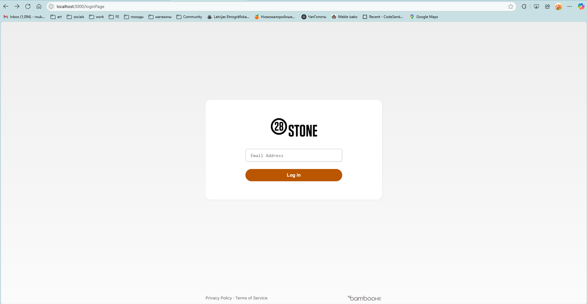
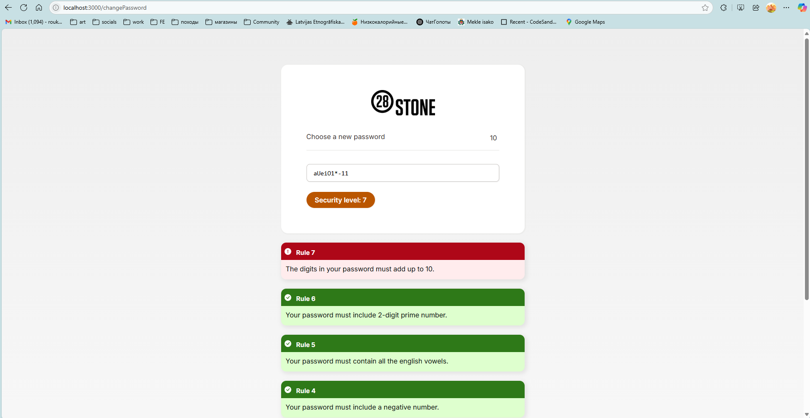
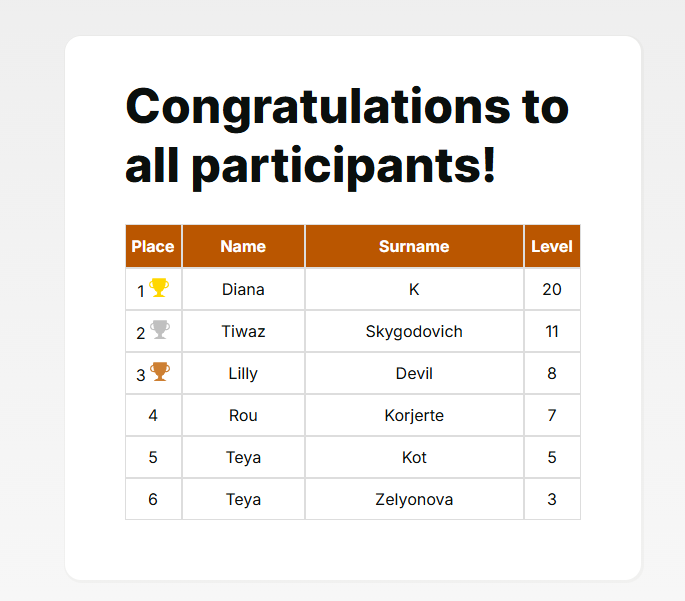

# 🔐 Password Game

A fun and quirky password challenge app designed to mimic an HR password reset page.  
Users create the most absurd and complex passwords while trying to beat the scoreboard!  

---

## 📸 Screenshots

  
*Login page. The structure of enterable email should be company specific. As it includes names and surnames of employees, I use this in logic to display names and surnames in the high-scores table*
  
*Different fun rules. Some of them are well known only by the company employees, like founders names*
 
*The scoreboard. If there are several users with same score, they are sorted by the completion time*

---

## 🛠 Technologies Used

- React (frontend)  
- Node.js (backend API)  
- REST API for user data and scoreboard  
- Deployed to production, accessed by 200+ users

---

## 🧠 Why I Made This

This project started as a playful idea to surprise my coworkers by turning a viral password game into a fake internal company login page.

🔹 I created the **entire visual design** from scratch, using already existing HR system.  
🔹 The **React frontend** is heavily modified — I customized the structure, added a fake login page, and connected it to a real-time **scoreboard**.  
🔹 I implemented a **custom API** in Node.js to save player names and scores, making the game interactive and competitive.  
🔹 Password validation logic is **based on an open-source version** of the original "Password Game", but I adapted it to my layout and connected it to my custom backend.

This project was both a fun prank and a serious learning experience — I practiced frontend integration, API work.  
It also helped me get comfortable **reading and modifying other people's code**, while keeping my own style and goals.

---

## 🚀 Getting Started

### 🔧 Prerequisites

- Node.js installed  
- npm or yarn package manager  
- Internet connection for API calls

### ⚙️ Installation & Running

1. Clone the repo:  
   ```bash
   git clone https://github.com/YOUR_USERNAME/YOUR_REPOSITORY.git
2. Go to the project folder:
   ```bash
   cd YOUR_REPOSITORY
3. Install dependencies:
   ```bash
   npm install
4. Run the app:
   ```bash
   npm run dev
5. Open in browser: http://localhost:3000

---

## ✨ Features

- Customized UI mimicking a corporate HR portal  
- Password creation with complex rules to make it fun and challenging  
- User name collection and secure API data storage (still improving security!)  
- Live scoreboard to track top players

---

## 🔮 Future Plans

- Improve API security to protect requests  
- Add more interactive password challenges  
- Enhance UI/UX for better user engagement  
- Integrate authentication to personalize experience

---

## 💬 Feedback welcome!

I'm always happy to hear suggestions, feedback or ideas! You can [open an issue](https://github.com/roukorjerte/1stApril28stone/issues/new) or contact me directly.

---

## 📄 License

MIT License
